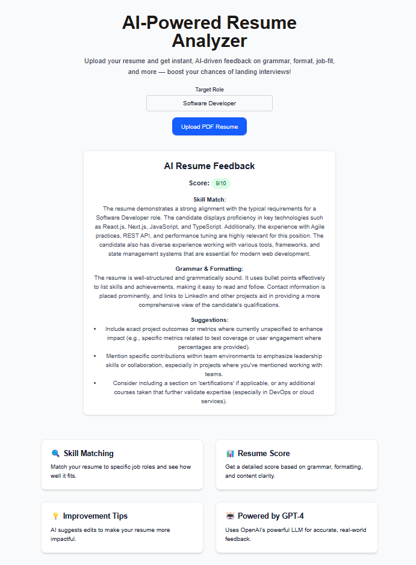

# 🧠 AI Resume Analyzer

A full-stack AI-powered resume analysis tool built with **Next.js**, **React**, and **OpenAI GPT-4o**. Upload your PDF resume, enter a job role, and get instant, actionable feedback on grammar, formatting, skill match, and overall resume score — tailored to the role you're applying for.

---

### 🚀 Features

- 🔍 Resume text extraction (PDF)
- 🤖 GPT-based AI feedback (role-specific)
- 📊 Score & suggestions in structured JSON format
- 💡 Clean UI with instant upload & result rendering
- 🛠 Built using `Next.js App Router`, `OpenAI`, `pdf-parse`

---

### 🛠 Tech Stack

| Frontend      | Backend         | AI / Parsing      | DevOps / Other       |
|---------------|------------------|-------------------|----------------------|
| React (Client) | Next.js API Routes | OpenAI GPT-4o API | Tailwind CSS         |
| TypeScript     | Node.js Runtime   | pdf-parse (PDF)     | Vercel Deployment    |

---

### 📦 Installation

```bash
git clone https://github.com/your-username/ai-resume-analyzer.git
cd ai-resume-analyzer
npm install
```

---

### 🔐 Setup Environment Variables

Create a `.env.local` file at the root of the project:

```
OPENAI_API_KEY=your_openai_api_key_here
```

> You must have billing enabled for your OpenAI account (ChatGPT Plus ≠ API access)

---

### 🧪 Run the Dev Server

```bash
npm run dev
```

Open [http://localhost:3000](http://localhost:3000)

---

### 📸 Screenshots



---
### 👨‍💻 Author

**Roshan Singh**  
Frontend & Full-stack Developer  
[LinkedIn](https://www.linkedin.com/in/roshan-k-singh/)

---

### 📄 License

This project is licensed under the [MIT License](LICENSE).